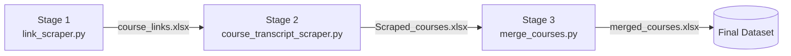

<p align="center">
  
</p>

<h1 align="center">CTS</h1>
<p align="center"><i>Course Transcript Scraper</i></p>

<p align="center">
  
  
  
</p>

A resumable, checkpointed Playwright pipeline that turns an online course catalog into a structured, transcript-level dataset.

## Table of Contents

- [Pipeline](#pipeline)
- [Features](#features)
- [Tech Stack](#tech-stack)
- [Project Structure](#project-structure)
- [Setup](#setup)
- [Usage](#usage)
- [Output Schema](#output-schema)
- [Design Decisions](#design-decisions)
- [Known Limitations & Roadmap](#known-limitations--roadmap)
- [Responsible Use](#responsible-use)
- [License](#license)

## Pipeline



| Stage | Script | Input | Output |
|---|---|---|---|
| 1. Link discovery | `link_scraper.py` | Topic/category URL | `<topic>_links.xlsx` |
| 2. Transcript scraping | `course_transcript_scraper.py` | Link list from Stage 1 | `Scraped_courses.xlsx` |
| 3. Merge | `merge_courses.py` | Multiple Stage 2 outputs | `merged_courses.xlsx` |

## Features

- **Resumable** — picks up from the last `Course Index` on restart
- **Checkpointed** — flushes to disk every 5 courses
- **Session persistence** — logs in once, reuses the saved session
- **Failure isolation** — fresh browser context per course
- **Deduplication** — tracks scraped URLs per run
- **Human-like pacing** — randomized delays and scroll increments
- **Transcript-aware** — drops rows with no extractable transcript

## Tech Stack

- [Playwright](https://playwright.dev/python/) — browser automation
- [pandas](https://pandas.pydata.org/) — data wrangling + Excel I/O
- [openpyxl](https://openpyxl.readthedocs.io/) — Excel engine

## Project Structure

```
cts/
├── link_scraper.py
├── course_transcript_scraper.py
├── merge_courses.py
├── requirements.txt
├── .gitignore
└── README.md
```

## Setup

```bash
git clone <your-repo-url>
cd cts
python -m venv venv && source venv/bin/activate   # Windows: venv\Scripts\activate
pip install -r requirements.txt
playwright install chromium
```

Before running, set in each script: `user_data_dir` (local browser profile path), the catalog URL, the `subject` tuple in `link_scraper.py`, and the input filename `course_transcript_scraper.py` reads.

## Usage

```bash
python link_scraper.py                # log in once, then scrapes course links
python course_transcript_scraper.py   # scrapes metadata + transcripts per course
python merge_courses.py               # merges output files into one dataset
```

Edit the `start`/`end` values in `course_transcript_scraper.py`'s `main()` to scrape a specific slice of the link list.

## Output Schema

**`<topic>_links.xlsx`**

| Column | Description |
|---|---|
| Course Link | Course URL |
| Course Title | Course name |
| Instructors | Comma-separated names |
| Skills | Comma-separated tags |
| Published On | Release date |

**`Scraped_courses.xlsx`**

| Column | Description |
|---|---|
| Course Index | Resumable counter |
| Course Link / Title | From Stage 1 |
| Instructor Name / Profile / Thumbnail | Course-page metadata |
| Released Date / Level / Course Details | Course-level metadata |
| Section | TOC section |
| Video Title / Link / Duration / Transcript | Video rows only |
| Quiz Title / Link | Quiz rows only |

> Video and quiz rows have different columns, so expect `NaN`s across the union.

## Design Decisions

- **Persistent auth** — one-time manual login; session reused via a persistent browser context, no stored credentials
- **DOM cleanup on scroll** — periodically clears processed cards to stop memory bloat on long infinite-scroll runs
- **Scroll-stall detection** — compares scroll position between batches to detect end-of-content
- **Isolated contexts per course** — one bad page can't crash the batch
- **Incremental writes** — saves every 5 courses instead of holding everything in memory
- **Transcript-gated rows** — only rows with an extracted transcript are kept

## Known Limitations & Roadmap

- Config hardcoded per script → move to `.env`/YAML/CLI args
- Stage 1 → 2 filename handoff is manual → keep in sync until centralized
- Error-tolerance trips after 1 error, not several → fix threshold constant
- Mixed schema for video/quiz rows → add explicit `Item Type` column
- Merge step computes reindexing but never applies it → apply or remove
- Login re-runs every execution → split into a one-time setup step
- Selectors are site-specific → will break if target site's frontend changes
- No tests, print-based logging → add `pytest` + structured logging

## Responsible Use

- Comply with the target site's Terms of Service and `robots.txt`
- Use only your own account and credentials
- Keep request rates conservative
- Don't redistribute scraped transcript text

## License

MIT — see [LICENSE](LICENSE).
